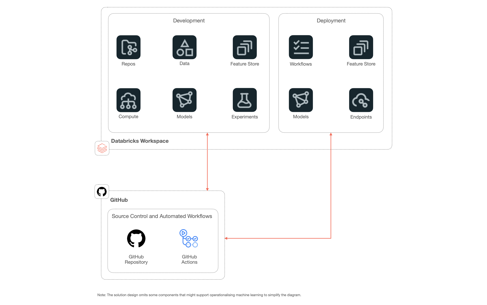
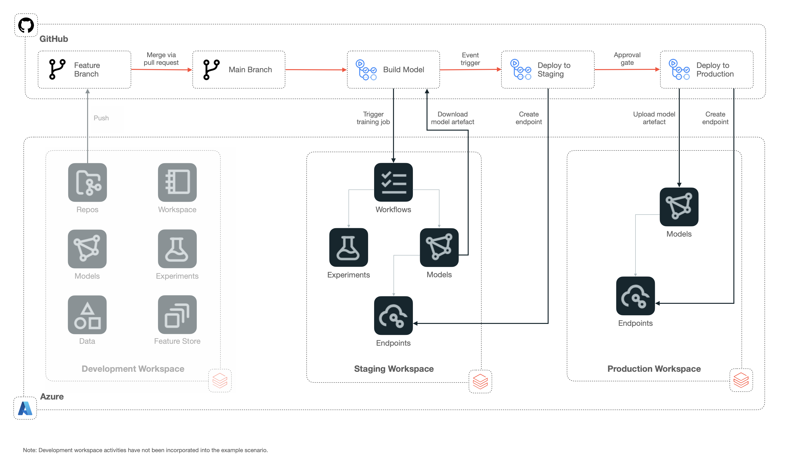

# Serving Endpoint Example Scenario

> **Note**:
> The purpose of this section is to provide an overview of the serving endpoint solution.

## Solution Overview

### Potential Use Cases

This approach is best suited for:

- Low-latency and interactive workloads
- Exposing machine learning models as a REST API to integrate with external applications

### Solution Design

This solution design aims to incorporate principles and practices of machine learning operationalisation (MLOps) as they can be applied to Azure Databricks. Some goals of implementing MLOps for machine learning projects include:

- Automated deployment of machine learning models to production.
- Creating secured, reproducible, and scalable machine learning workflows.
- Manage models and capture data lineage.
- Enable continuous delivery with IaC and CI/CD pipelines.
- Monitor performance and feedback information from models.
- Providing compliance, security, and cost tools for machine learning development.
- Increasing collaboration and experimentation.

The below diagram shows a high-level design for implementing online scoring workloads suitable for classical machine learning scenarios using Azure Databricks.

The solution consists of:

- **Repos:** visual Git client that supports common Git operations such as cloning a repository, committing and pushing, pulling, and branch management.
- **Data:** production-grade data available as managed Delta tables in Unity Catalog or in the Hive Metastore.
- **Feature Store:** centralized repository that enables users to find and share features and consistently reproduce feature values for model training and inference.
- **Compute:** compute options where data scientists can access data, explore data and develop machine learning models.
- **Models and Experiments:** place to store machine learning models and experiment metrics.
- **Workflows**: orchestrates data processing, machine learning, and analytics pipelines via jobs that can consist of a single task or can be a large, multi-task workflow with complex dependencies.
- **Serving Endpoints:** managed endpoints used to host the model artifact for online inferencing.
- **Source control:** solution to track code.
- **Automated workflows:** workflows to automate the build and deployment of different components used in the solution.

### Continuous Integration and Continuous Delivery Workflow

The below diagram shows the overall CI/CD process as built with GitHub Actions. This approach consists of three environments consisting of an identical set of resources.

The environments include:

- **Development:** used by developers to build and test their solutions.
- **Staging:** used to test deployments before going to production in a production-like environment. Any integration tests are run in this environment.
- **Production:** used for the final production environment.

The end-to-end workflow operation consists of:

1. Triggering the `Model Build` workflow based on an event (e.g. merging code to the main branch via a pull request).
2. Executing model training from a notebook as a one-time Databricks Job in the Staging workspace.
3. Registering the model artifact in the model registry in the Staging workspace.
4. Automatically triggering the `Deploy Serving Endpoint` workflow upon completion of the `Build Model` workflow.
5. Deploying the model to a Serving Endpoint in the Staging workspace and executing necessary tests.
6. Downloading the model artifact in the model registry in the Staging workspace and re-registering a copy of the model artifact in the model registry in the Production workspace.
7. Deploy the model to a Serving Endpoint in the Production workspace that can be integrated with other applications.
8. Monitoring performance-related metrics of the Serving Endpoint.

> **Note**:
> Monitoring and alerting for data drift have not been incorporated into this example scenario. To incorporate this inference data will need to be collected from the request payload, analysed as a Databricks job, and presented in a monitoring platform such as Azure Monitor for end-user consumption.

## Related Resources

You might also find these references useful:

- [Model serving with Databricks](https://docs.databricks.com/machine-learning/model-serving/)
- [MLOps workflow on Databricks](https://docs.databricks.com/machine-learning/mlops/mlops-workflow.html)
- [Implementing MLOps on Databricks using Databricks Notebooks and Azure DevOps](https://www.databricks.com/blog/2022/01/05/implementing-mlops-on-databricks-using-databricks-notebooks-and-azure-devops-part-2.html)
