# Step-by-Step Setup

> **Note**:
> The purpose of this section is to describe the steps required to set up all parts of this example scenario.

## Prerequisites

Before implementing this example scenario the following is needed:

- Azure subscription (contributor or owner)
- GitHub account

## 1. Initial Setup

> **Note**:
> As with all Azure Deployments, this will incur associated costs. Remember to teardown all related resources after use to avoid unnecessary costs.

### 1.1. Deploy Azure Resources

You will need to create a resource group for resources associated with **`Staging`** and **`Production`** environments. The same or separate resource groups can be used.

Use the `Deploy to Azure` button below to automatically deploy these resources. You will need to do this twice to deploy two separate instances for **`Staging`** and **`Production`** respectively.

> **Note**:
> No settings need to be changed except the `Resource Instance` parameter (e.g. `001` and `002` respectively).

[](https://portal.azure.com/#create/Microsoft.Template/uri/https%3A%2F%2Fraw.githubusercontent.com%2Fnfmoore%2Fazure-databricks-mlops-example-scenarios%2Fmain%2Finfrastructure%2Fmain.json)

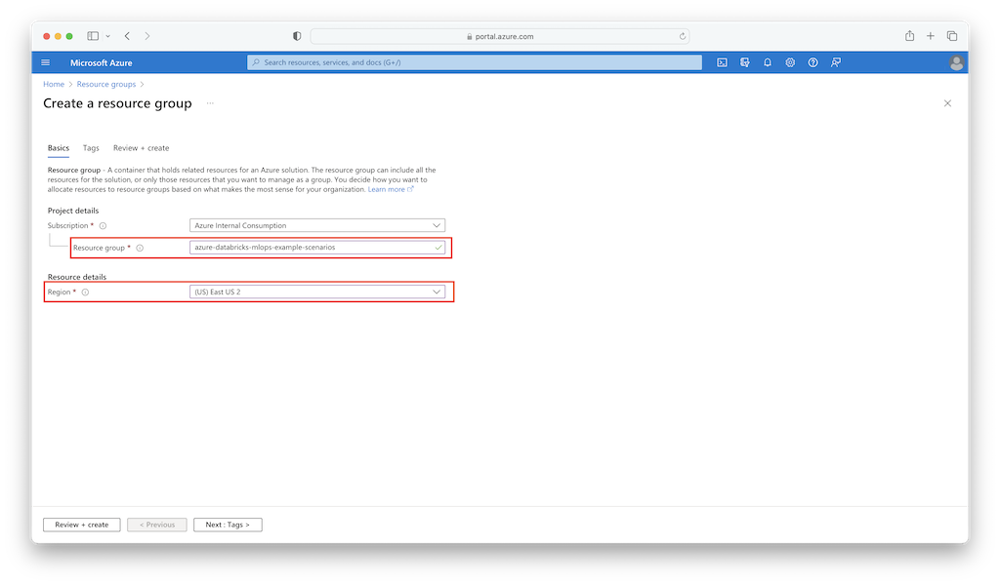

Once these have been created a service principal must be created with a **`contributor`** role assigned to each resource group. The following command can be used to create this service principal.

```bash

az ad sp create-for-rbac --name <service-principal-name> --role contributor --scopes /subscriptions/<subscription-id>/resourceGroups/<resource-group-name> --sdk-auth
```

> **Note**:
> Use the [Azure Cloud Shell](https://learn.microsoft.com/azure/cloud-shell/overview)

The command should output a JSON object similar to this:

```bash
 {
 "clientId": "<GUID>",
 "clientSecret": "<STRING>",
 "subscriptionId": "<GUID>",
 "tenantId": "<GUID>",
 "resourceManagerEndpointUrl": "<URL>"
 (...)
 }
```

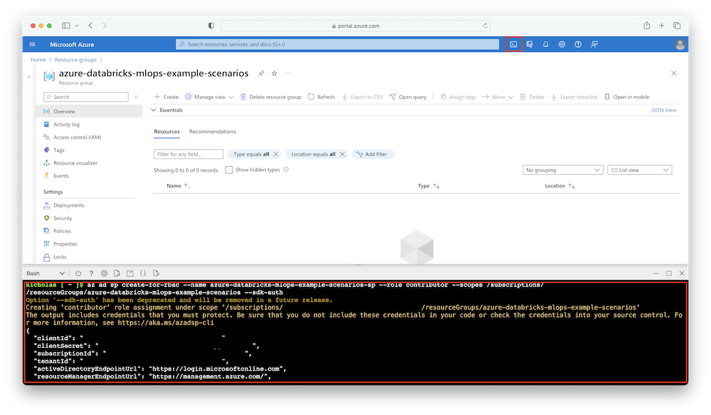

> **Note**:
> The aim of this example scenario is to set up a simple proof-of-concept, therefore a single resource group is used. If separate resource groups are required, the following instructions/steps will need adjustment to reflect this.

> **Note**:
> Store this JSON object since it will be required in subsequent steps.

### 1.2. Upload Data to Azure Databricks

The data used to train the machine learning model as part of this example scenario has been prepared and available as part of this repository in the `core/data` directory.

This data will be available in the Azure Databricks workspace as a managed Delta Lake table. To create this table you will use the UI to upload the `core/data/curated.csv` CSV file to create this managed table.

First, you will need to open the Databricks workspace. From the Azure portal click on the `Staging` Databricks workspace and click `Launch Workspace`.

> **Note**:
> Record the value of `URL` for the Databricks Workspace. This corresponds to the Databricks Host. This value will be used in subsequent steps. This value will need to be recorded for both `Staging` and `Production` workspaces.

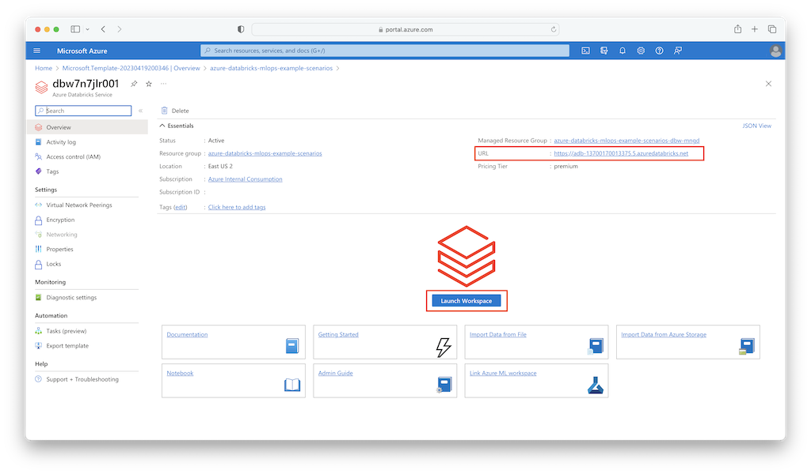

From the `Data` section in the sidebar of the Databricks workspace click `Add` and then `Add data` from the drop-down.

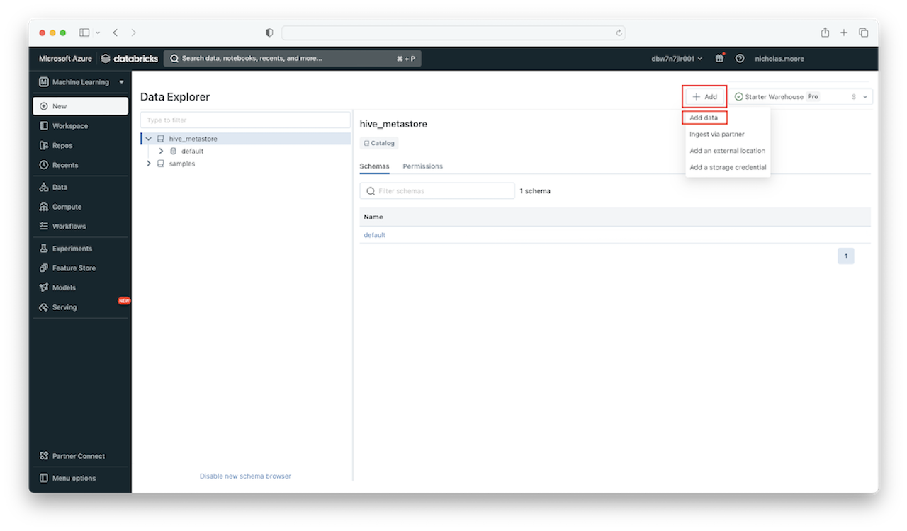

Select the `Upload data` option which will allow you to upload the `core/data/curated.csv` file from your local machine.

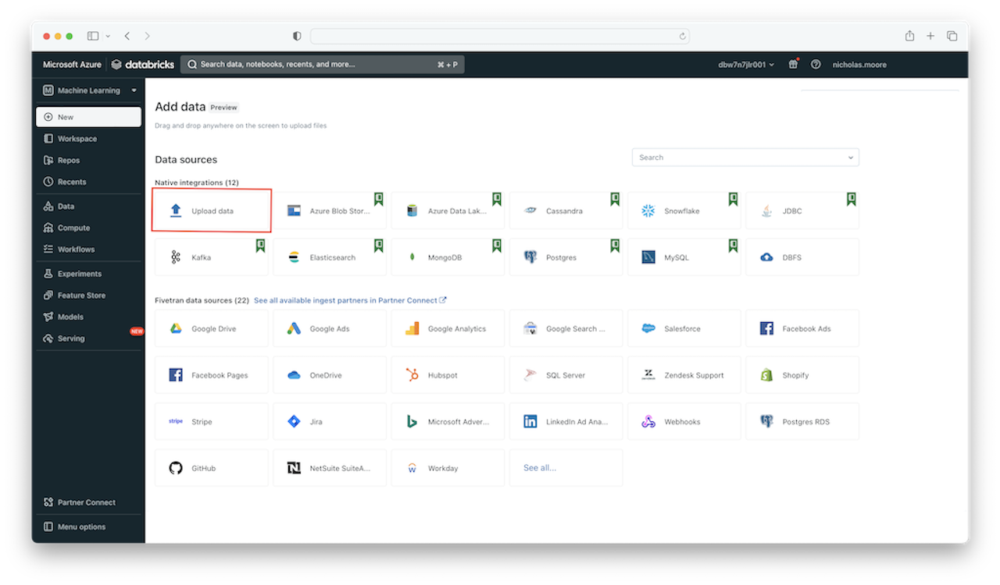

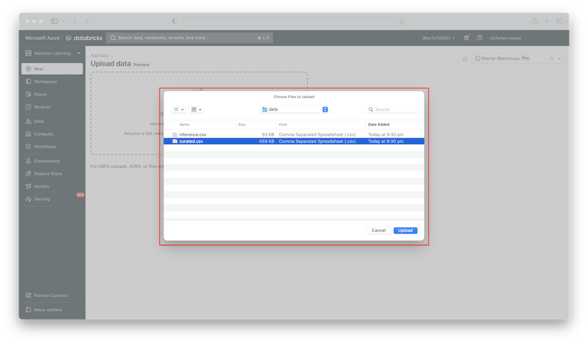

Once you have selected the file, set the name of the managed table as `employee_attrition_curated` as part of the `default` table within the `hive_metastore`. Click `Create table` to ensure the table is created and available in your workspace.

> **Warning**:
> The notebook to train and register the machine learning model will read this dataset from the `default.employee_attrition_curated` table. If you change the name or location of this managed table when uploading the data you will need to ensure appropriate changes are made to the `notebooks/train_model.py` notebook to ensure the data can be read correctly.


You can learn more about uploading data to Azure Databricks [here](https://docs.databricks.com/ingestion/add-data/upload-data.html).

### 1.4 Add a Service Principal to the Workspace

The Service Principal created in `1.1` will be used during workflow automation. To enable this the [SCIM API 2.0](https://docs.databricks.com/dev-tools/api/latest/scim/scim-sp.html) will be used to add the service principal as a workspace administrator of the Azure Databricks workspace (in both `Staging` and `Production` environments).

A script has been prepared below to assist with this but first, an `Access Tokens` for a current workspace admin must be created to authenticate when calling the SCIM API.

The user with Azure Contributor or Owner roles over the subscription that executed the above custom deployment to create the workspaces should also be a workspace admin.

To create an `Access Tokens` this user can navigate to `User Settings` from the header.

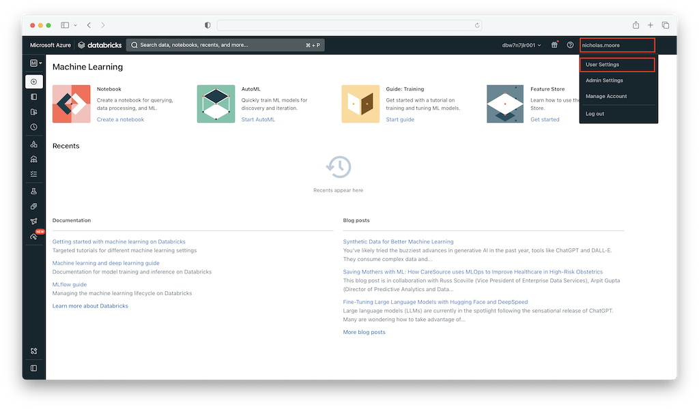

From `User Settings`, under the `Access Tokens` menu, click the `Generate New Token` button. Enter a name for the token and click the `Generate` button.

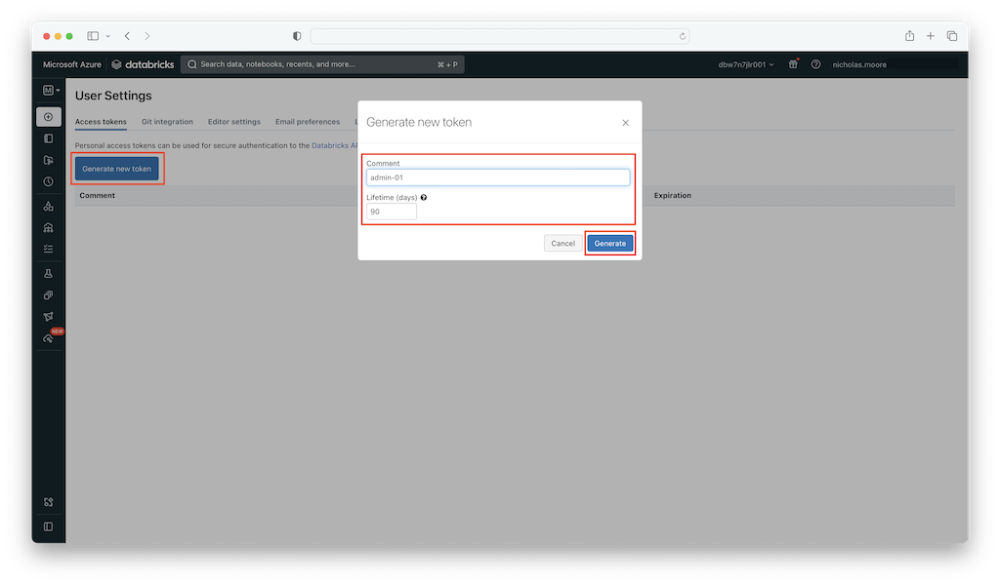

Once this has been created the following command can be used to create this service principal as a workspace admin.

> **Note**:
> Use the [Azure Cloud Shell](https://learn.microsoft.com/azure/cloud-shell/overview)

> **Warning**:
> Ensure you replace the values of `<databricks-host>`, `<access-token>`, `<service-principal-client-id>` with the corresponding values in sections in `1.1` and `1.2` above.

```bash
DATABRICKS_HOST=<databricks-host>
ACCESS_TOKEN=<access-token>
 
CLIENT_ID=<service-principal-client-id>
SERVICE_PRINCIPAL_NAME=<service-principal-name>
 
GROUPS_RESPONSE=$(curl --location "${DATABRICKS_HOST}/api/2.0/preview/scim/v2/Groups" --header "Authorization: Bearer ${ACCESS_TOKEN}")
 
GROUP_ID=$(jq -c '.Resources[] | select(.displayName | contains("admins")) | .id' -r <<< "$GROUPS_RESPONSE")
 
curl --location "${DATABRICKS_HOST}/api/2.0/preview/scim/v2/ServicePrincipals" \
 --header "Content-Type: application/json" \
 --header "Authorization: Bearer ${ACCESS_TOKEN}" \
 --data '{
 "schemas": [
 "urn:ietf:params:scim:schemas:core:2.0:ServicePrincipal"
 ],
 "applicationId": "'"${CLIENT_ID}"'",
 "displayName": "'"${SERVICE_PRINCIPAL_NAME}"'",
 "groups": [
 {
 "value": "'"${GROUP_ID}"'"
 }
 ],
 "entitlements": [
 {
 "value": "workspace-access"
 },
 {
 "value": "databricks-sql-access"
 },
 {
 "value": "allow-cluster-create"
 }
 ]
}'

```

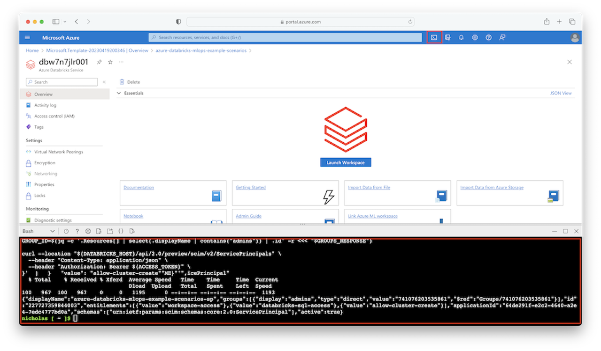

Once this script has been executed you can confirm the Service Principal has been added as a workspace admin by navigating to the `Admin Settings` from the header and clicking on the `Groups` tab. When viewing the `admin` group for the Azure Databricks workspace the `<service-principal-name>` should be listed in the `User or Group Name` column of the table.

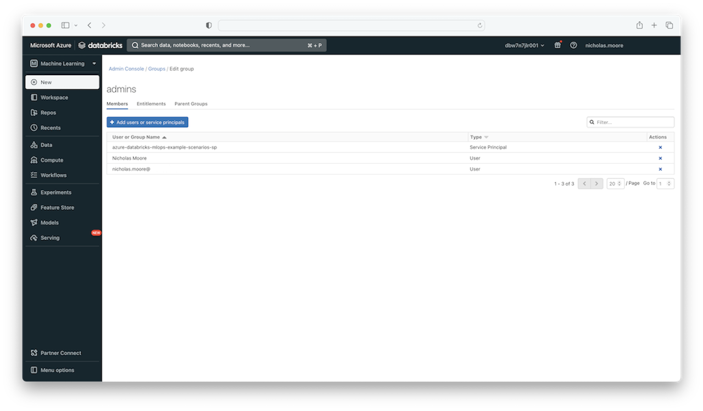

This step will need to be repeated for both `Staging` and `Production` workspaces.

### 1.5. Create GitHub Repository

Log in to your GitHub account and navigate to the [azure-databricks-mlops-example-scenarios](https://github.com/nfmoore/azure-databricks-mlops-example-scenarios) repository and click `Use this Template` to create a new repository from this template.

Rename the template and leave it public. Ensure you click `Include all branches` to copy all branches from the repository and not just main.

Use [these](https://docs.github.com/en/github/creating-cloning-and-archiving-repositories/creating-a-repository-from-a-template) instructions for more details about creating a repository from a template.

### 1.6. Configure GitHub Actions Environments

First, you will need to configure a GitHub Action secret. These are encrypted environment variables used within GitHub Actions Workflows.

Click the `Settings` tab in the menu bar of your GitHub repository and on the new page then select `Secrets` from the sidebar. Click the `New Repository Secret` button to create a new secret.

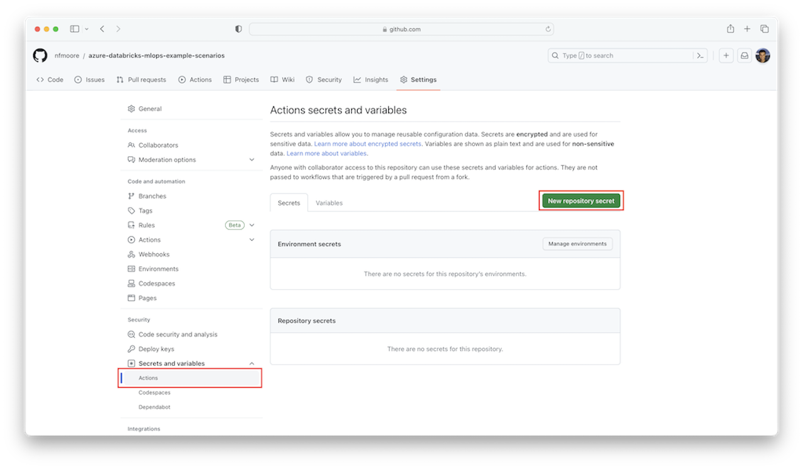

Set the name of this secret as `AZURE_CREDENTIALS` with the value of the output from the service principal created in section `1.1` and then the `Add Secret` button to create the secret.

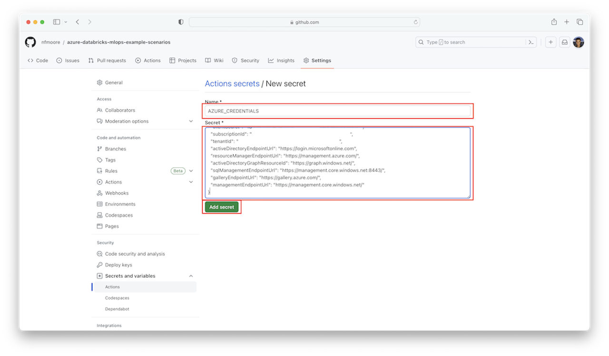

Next, two GitHub Environments used to describe the `Staging` and `Production` environments will need to be created along with environment protection rules for the `Production` environment.

To set up these environments, from the GitHub repository you created in `1.3` click the `Settings` tab in the menu bar. On the new page select `Environments` from the sidebar. Click the `New Environment` button and create an environment with the `Name` of `Staging`. Repeat this to create a second environment with the `Name` of `Production`.

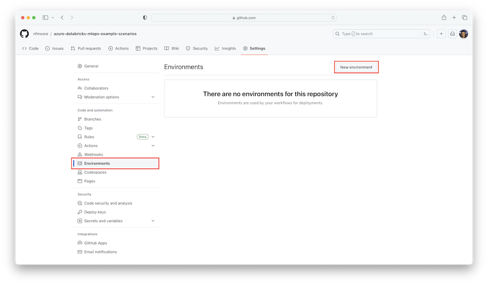

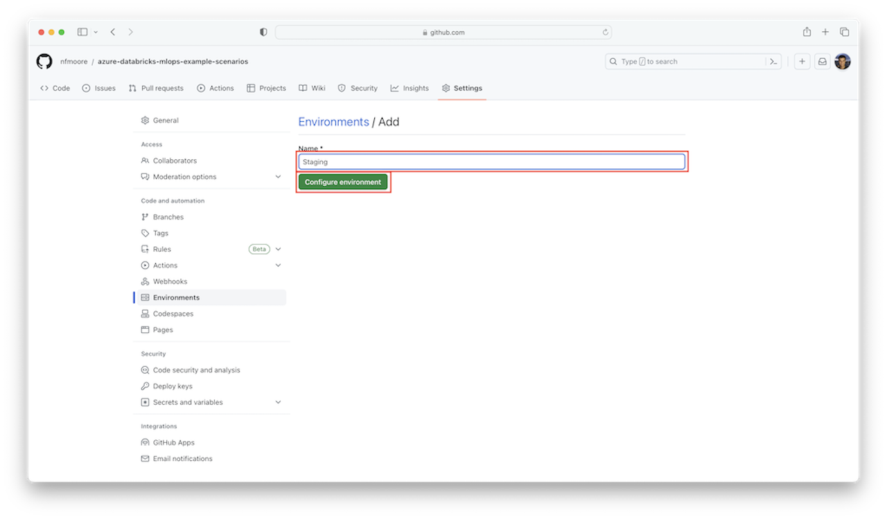

You need to create a variable called `DATABRICKS_HOST` in each environment. The value of this variable can be found in the Databricks resources deployed into your resource group in section `1.1` above.

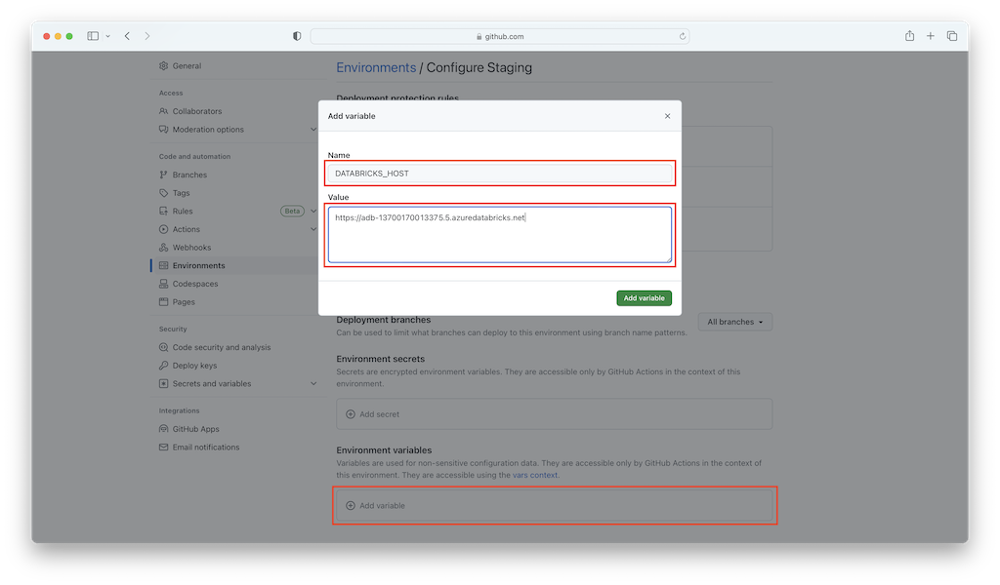

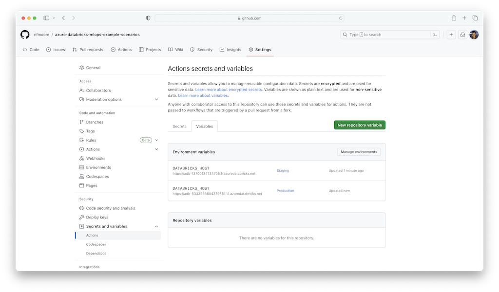

After creating the above secret and variables for the environments, you will need to enable `Required Viewers` before deploying to the `Production` environment. `Required Viewers` allow you to specify people or teams that may approve workflow runs when they access this environment.

To enable `Required Viewers`, under the `Environment Protection Rules` section, click the checkbox next to `Required Viewers` and search for your GitHub username and select it from the dropdown and click the `Save Protection Rules` button.

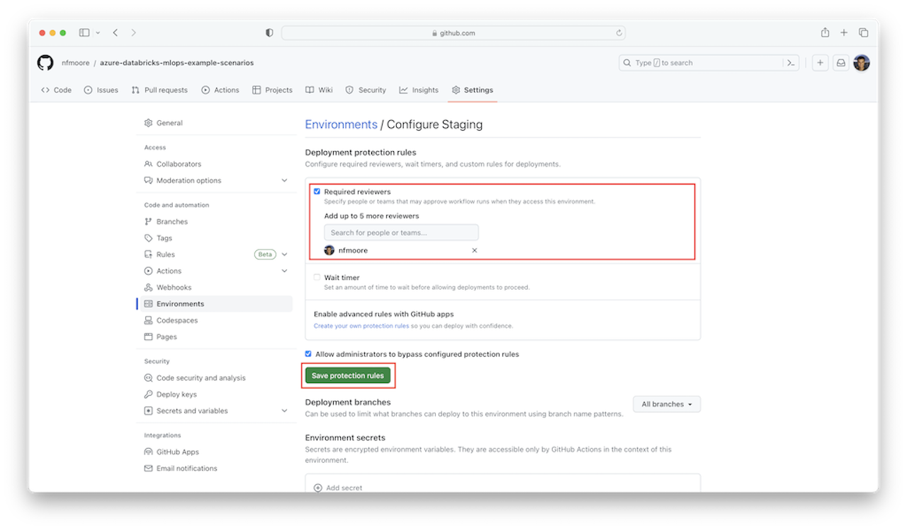

## 2. Execute Workflows

From your GitHub repository select **`Actions`** from the menu. From here you will be able to view the GitHub Action implementing the CI/CD pipeline for this example scenario. By default, the workflow in this example scenario is triggered manually within GitHub.

In this example scenario, four workflows have been developed in the `.github/workflows` directory. The main workflows in this example scenario are:

- `Code Quality`: workflow implementing regular code scanning on select branches when code is pushed and on a schedule.
- `Build Model`: a workflow that trains a model in a staging environment. Triggering this workflow on a schedule can be used to implement a model retraining process.
- `Deploy Serving Endpoint`: creates a serving endpoint in the Databricks workspace in the `Staging` and `Production` environments. for the machine learning model. This workflow is triggered automatically upon completion of the `Build Model` workflow.

To execute the workflow you can manually trigger the workflow in GitHub Actions `Workflows` menu. In the sidebar, you will need to trigger the `Build Model` workflow. To trigger a workflow, select the workflow then click `Run workflow`.

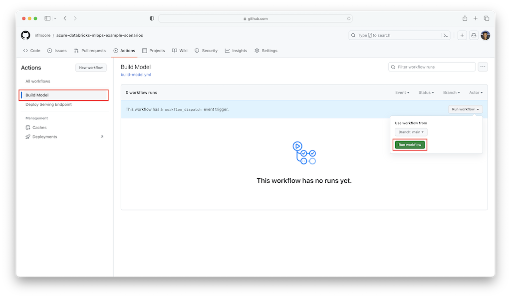

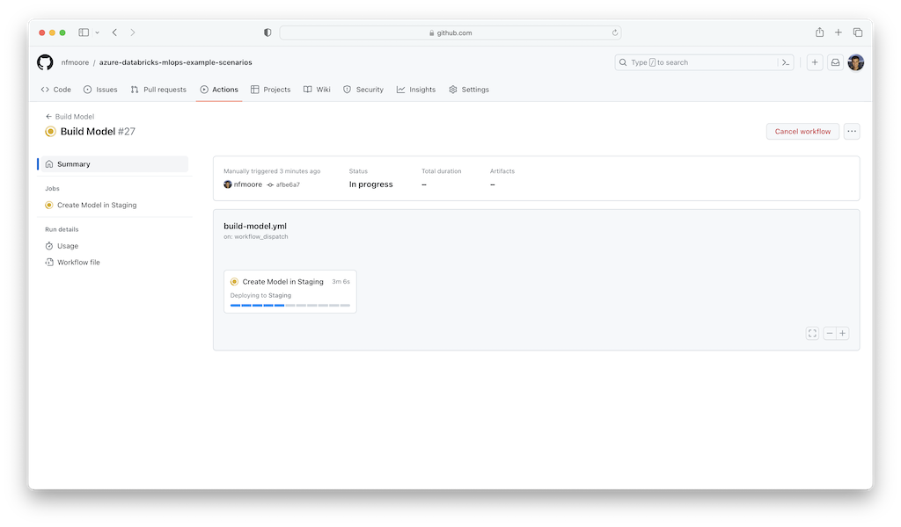

After the `Build Model` workflow is complete an MLFlow model will be registered in the staging environment and downloaded and stored as a workflow artifact. The `Deploy Serving Endpoint` will be triggered automatically upon completion of this workflow.

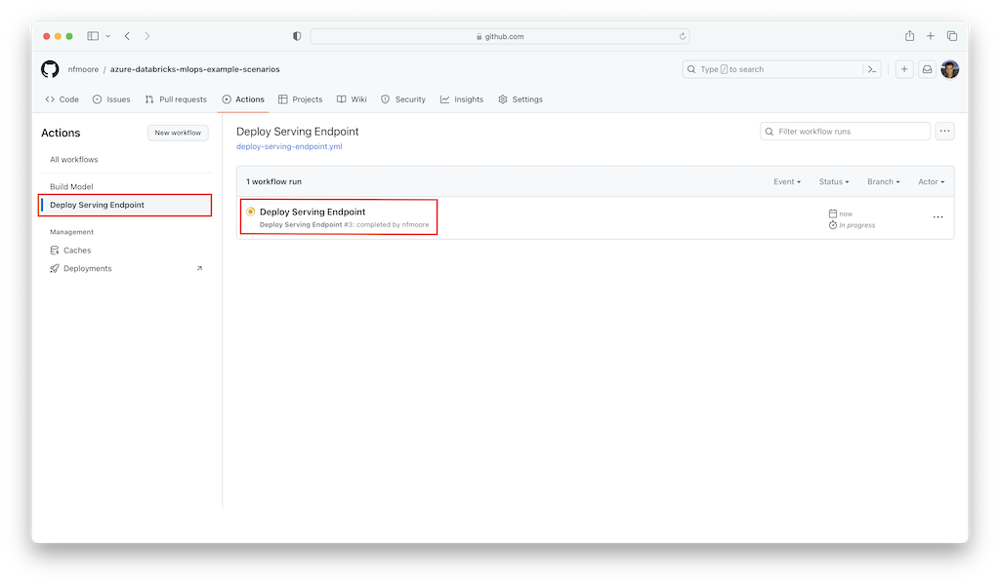

Manual approval is required to deploy artifacts to the `Production` environment. When prompted, click the `Review Deployment` button to approve, adding notes as required.

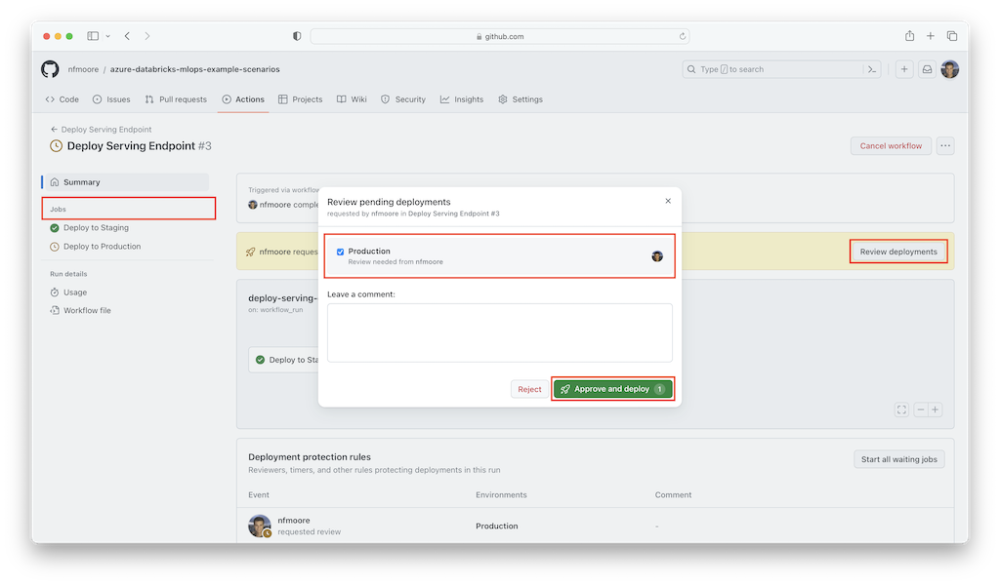

Once the workflow has finished executing all artifacts will have been deployed to both `Staging` and `Production` environments.

### Next Steps

From the `Models` section in the sidebar of the Azure Databricks workspace, you can view the registered models and associated versions that have been deployed by the GitHub Actions workflow.

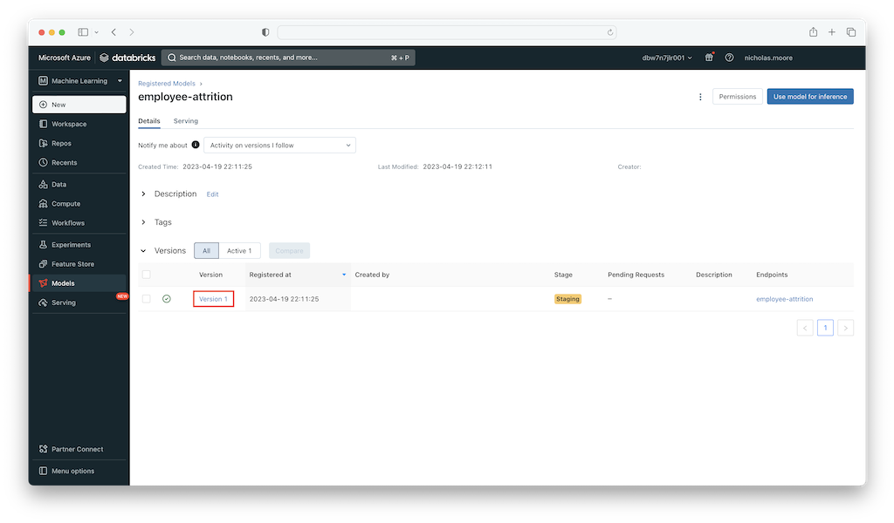

From the `Serving` section in the sidebar of the Azure Databricks workspace, you can view the serving endpoints that have been deployed and the model versions that they correspond to.

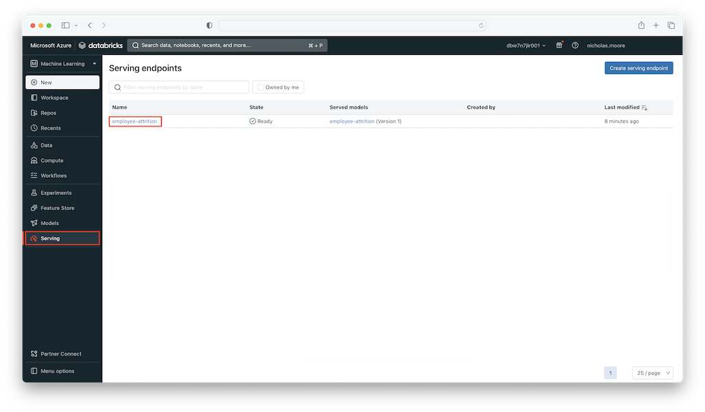

The serving endpoints can be tested by clicking the `Query endpoint` button. This will open a window from which you can enter the request body containing the data to send for scoring. Click the `Show example` button to pre-populate this box with an example and then click `Send request` to generate predictions.

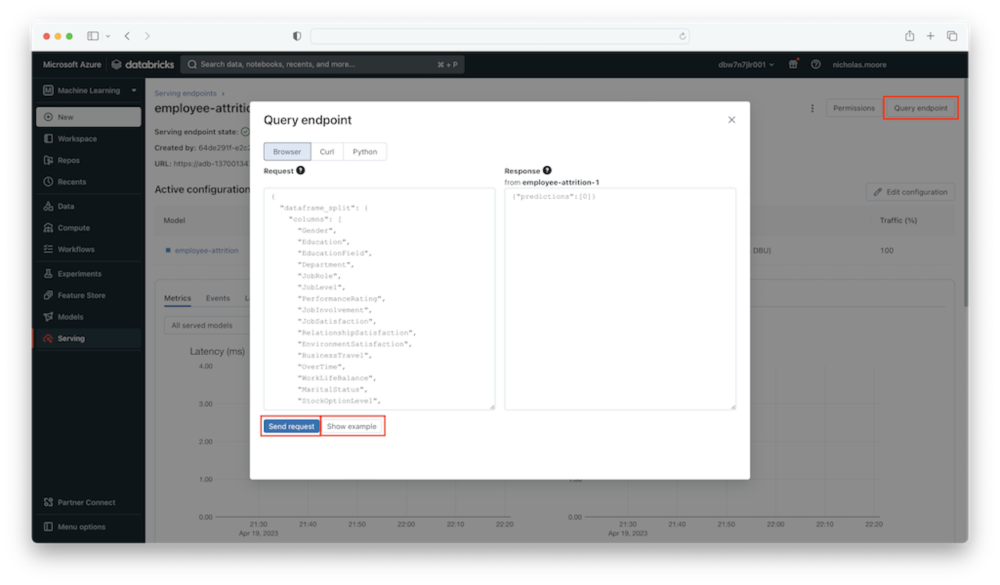

You can also view performance metrics associated with each serving endpoint to assist with infrastructure monitoring of your serving endpoints.

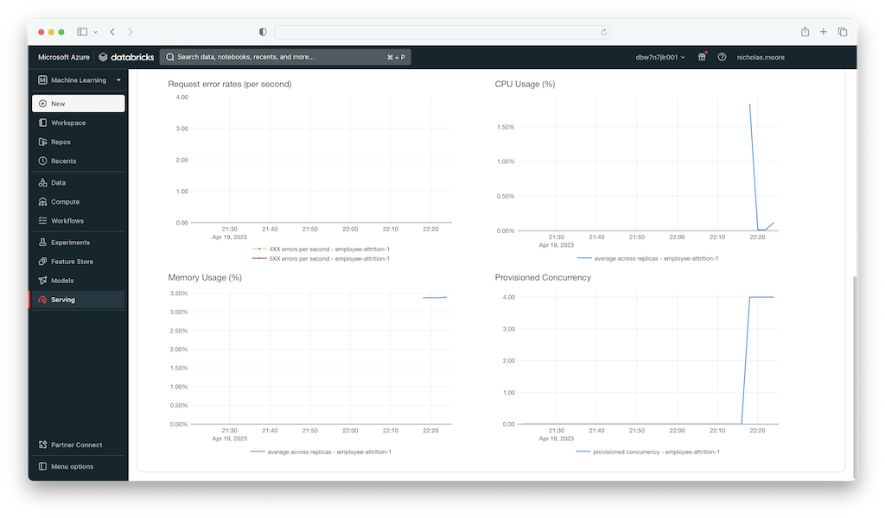

## Resource Clean-Up

Two tasks are required to clean up this example scenario:

1. Delete the Azure Resource Group
2. Delete the Service Principal

To delete the Azure Resource Group, navigate to the resource group and select `Delete resource group`. This will then prompt a confirmation screen, requiring the resource group name to be entered and the `Delete` button to be selected.

To delete the Service Principal, run the following command (with your service principal name) from the Azure Cloud Shell:

```bash
az ad sp delete --id <service-principal-name>
```

## Related Resources

You might also find these references useful:

- [Azure Databricks Administration iIntroduction](https://learn.microsoft.com/azure/databricks/administration-guide/)
- [Using Environments for Deployment](https://docs.github.com/en/actions/deployment/targeting-different-environments/using-environments-for-deployment)
- [Understanding GitHub Actions](https://docs.github.com/en/actions/learn-github-actions/understanding-github-actions)
